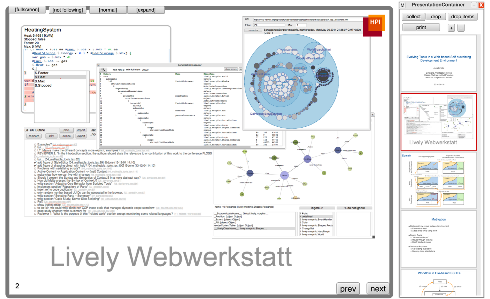
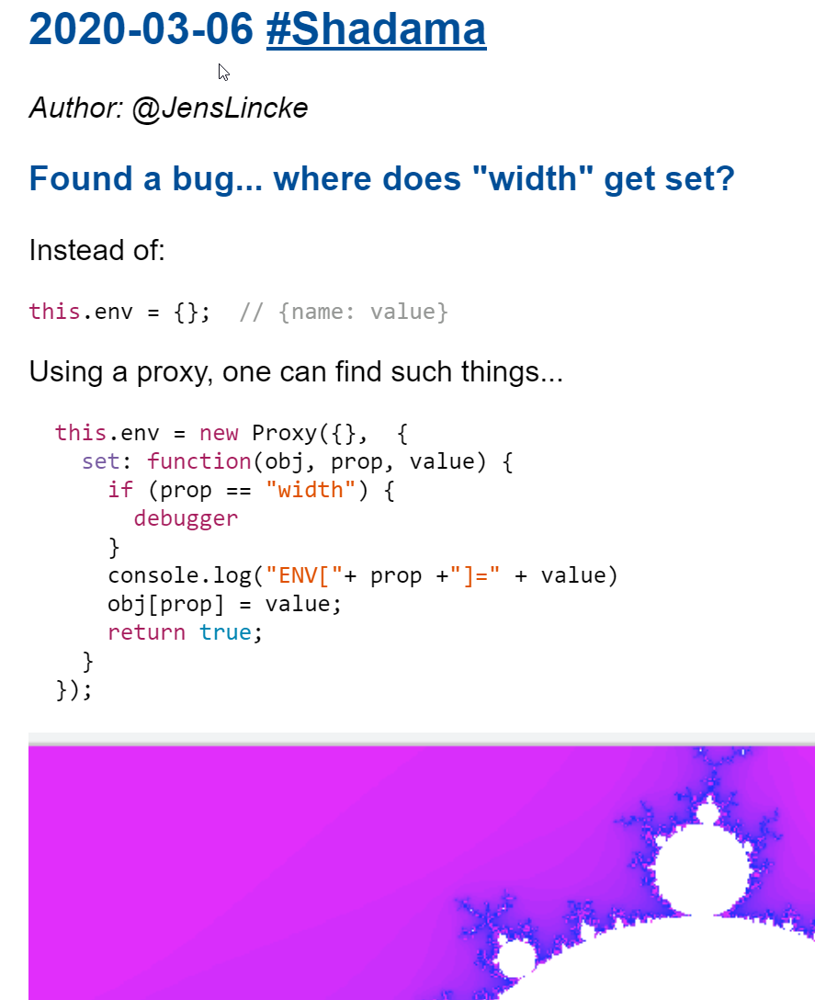
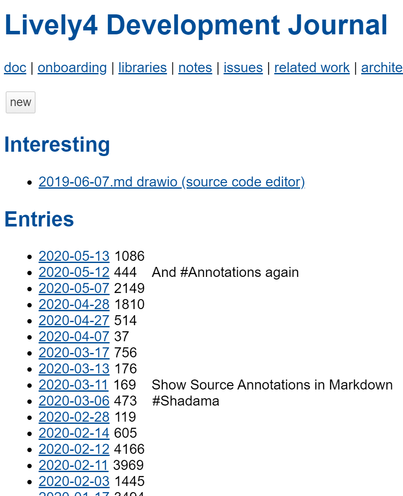
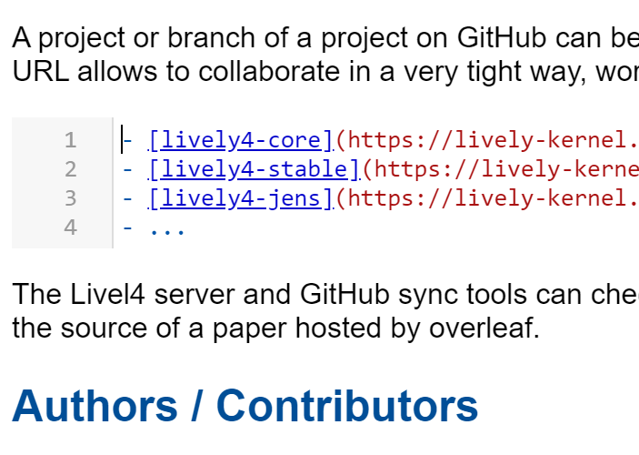
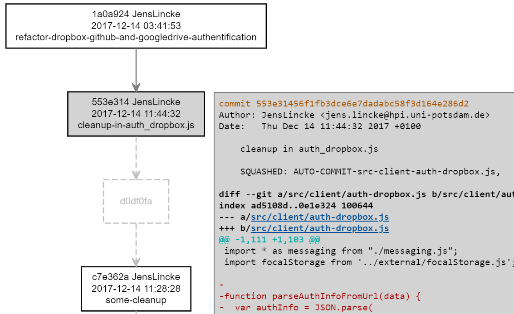
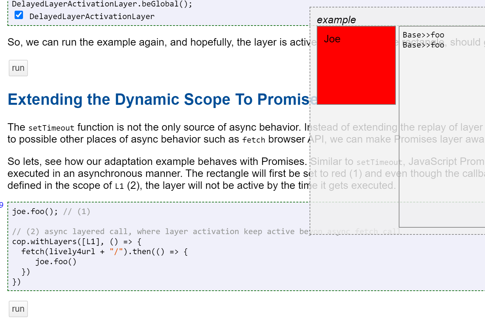
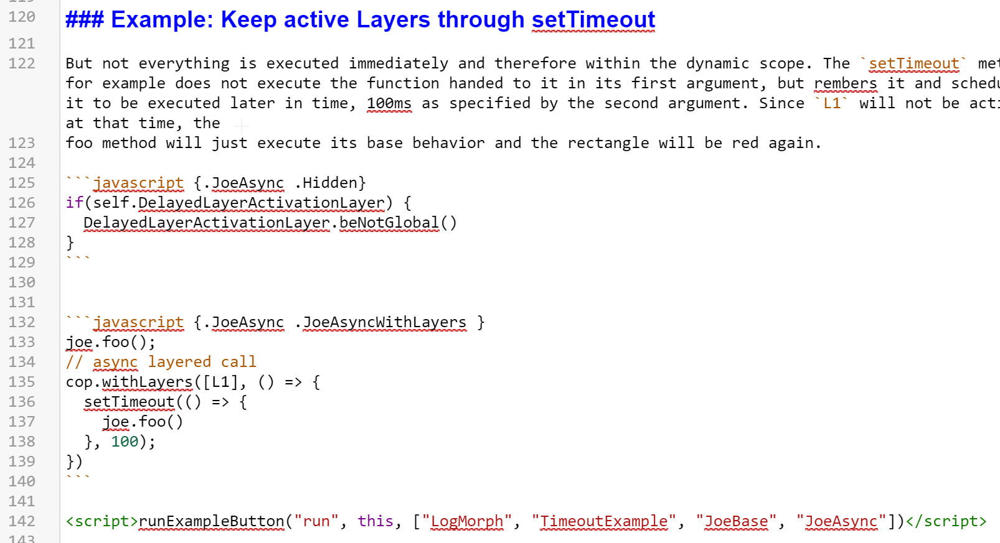

<!-- markdown-config presentation=true -->

<style data-src="../../src/client/presentation.css"></style>

<script>
import Presentation from "src/components/widgets/lively-presentation.js"
Presentation.config(this, {
    pageNumbers: true,
    logo: "https://lively-kernel.org/lively4/lively4-seminars/PX2018/media/hpi_logo.png"
})
</script>


<div class="title">
  Lively4 — An Active Wiki <br> of Markdown and JavaScript
</div>

<div class="authors">
  <u>Jens Lincke</u>, Stefan Ramson, Robert Hirschfeld
</div>

<div class="credentials">
  2020<br>
  <br>
  TokyoTech HPI Joint Seminar 
</div>

---

<!-- # Lively4 -->


- Self-supporting collaborative development environment
  - Collaborative Wiki-like development environment 
  - [Markdown](../../doc/workflows/markdown.md), [Scripts](../../doc/workflows/scripts.md) and  [Web-components](../../doc/workflows/web-copmponents.md)
  - Clash of "low-tech" Wiki-technology
- Runs in the browser on the client side 
  - Standard [JavaScript](../../doc/workflows/javascript.md), [HTML](../../doc/workflows/html.js), and [CSS](../../doc/workflows/css.md) 
- [lively4-server](https://lively-kernel.org/lively4/lively4-server) 
  - [clone](tools/sync.md) github projects and work collaboratively on them 

---

# Motivation

- Lively Kernel Project
  - Use Web-technology to escape Web-technology to go direction of Smalltalk
  - Lively4 tries to embrace and leverage the Web
- Related: Directly editing files on Github
  - And see result in updated Github Page or a Travis build
  - But not Self-supporting and no scripting (in Wiki)



---
## Workflows


---
## A Markdown Wiki in Lively


- First Level: Editing Text 
  - [A random Developer Journal Entry](../../doc/journal/2020-03-06.md/index.md)
- Second Level: Making them active with scripts
  - [The Index Page that generates an overview of all Journal Entries](doc/journal/index.md)

{style="border:1px solid gray;float:left" width=300}
{style="border:1px solid gray; margin-left:50px" width=300}
<!--
- Idea: Making the magic of personal shell scripts collaborative 
- Open Questions: We know the downfall of Macros... So let's all be friends 
  - ("When it comes to security, we usually ignore it" )
-->

---
## Aspects we where interested

- Live Programming Feedback
  - Updating rendered view (while editing)
  - mapping source to rendered object (and back)
- Editing (text) objects and updating source (#WIP)
  - partially editing source
  - local editing of text objects and partial updating of source
    <br> {height=150}
  - active elements that change code

{height=150 style="border: 1px solid gray; float:right"}

Take this list:

- [x] done
- [ ] not done
  
  
---
### ... leading to Wiki-pages as Tool (Prototypes)

- [TODO list](../../doc/files/todo.md)
- [ChangeGraph](../../doc/files/changesgraph.md) <br> {width=400}
- [Booklog](../../demos/visualizations/bootlog.md) <br> {width=400}
---
## Tools as Web-components

- Which when used may evolve into reusable Web-components based Tools

```html
<lively-window title="My Inspector">
  <lively-inspector><lively-inspector>
<lively-window>
```


---
## But also backwards: JavaScript files with Markdown 

[lively-handwriting](edit://src/components/widgets/lively-handwriting.js)
[lively-editor](edit://src/components/tools/lively-editor.js)


---
## Code (Listings) in Text and Active Code in Text

- [Draft/Prototype of ContextJS/Promises](https://lively-kernel.org/research/Draft-COP18-Promises/content/implementation.md)
  <br> {width=400}
- Test, Code Listings and Active Code.. <br> {width=400}


---

## Summary


